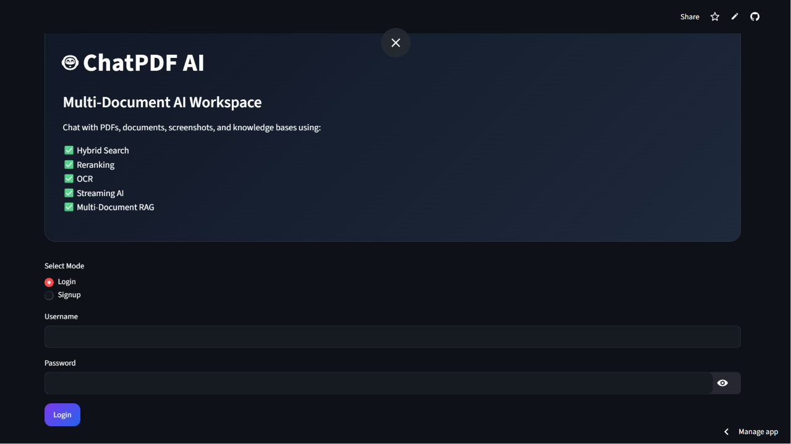
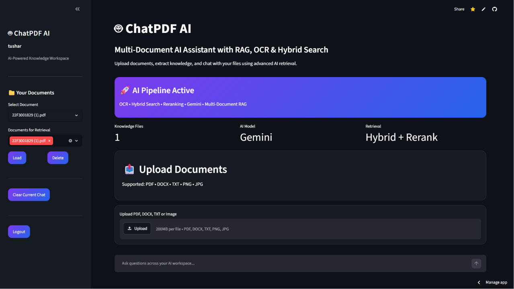
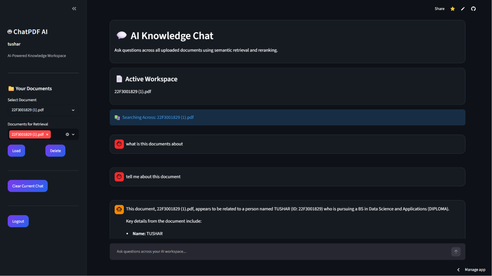

# 🤖 ChatPDF AI


An intelligent multi-document RAG (Retrieval-Augmented Generation) application that allows users to upload PDFs, DOCX files, and scanned documents, then chat with them using Google's Gemini AI.

Built with Streamlit, LangChain, ChromaDB, Supabase, and EasyOCR.

---

## 🚀 Live Demo

🔗 **Live Application:** https://chatpdf--ai.streamlit.app/

🔗 **GitHub Repository:** https://github.com/Tusharposwal/chatpdf-ai

---

# 📸 Application Preview

## Login Page



## Workspace Dashboard



## AI Knowledge Chat



# ✨ Features

### 📄 Multi-Document Chat

* Upload and chat with multiple PDFs simultaneously
* Query across all selected documents
* Compare information between documents

### 🤖 AI-Powered Question Answering

* Google Gemini powered responses
* Context-aware answers
* Retrieval-Augmented Generation (RAG)

### 🔍 Hybrid Search

Combines:

* Vector Search (Semantic Similarity)
* BM25 Keyword Search

This improves retrieval accuracy for both semantic and exact-match queries.

### 🖼 OCR Support

Extract text from:

* Scanned PDFs
* Images
* Screenshots
* Document photos

Powered by EasyOCR.

### 👤 User Authentication

* Secure user registration
* Login system
* Password hashing with bcrypt

### 💬 Chat History

* Persistent chat history
* Conversation restoration
* Document-specific chat sessions

### ☁️ Cloud Storage

* Files stored in Supabase Storage
* User-isolated document storage
* Automatic cleanup on deletion

### 🔄 Automatic Vector Rebuild

If the vector database is lost or reset:

* Files are downloaded from storage
* Embeddings are regenerated
* Knowledge base is rebuilt automatically

---

# 🏗 System Architecture

```text
                    ┌─────────────────┐
                    │      User       │
                    └────────┬────────┘
                             │
                             ▼
                    ┌─────────────────┐
                    │   Streamlit UI  │
                    └────────┬────────┘
                             │
                             ▼
                    ┌─────────────────┐
                    │ File Upload     │
                    └────────┬────────┘
                             │
             ┌───────────────┼───────────────┐
             ▼                               ▼
     ┌──────────────┐               ┌──────────────┐
     │ Text Extract │               │ OCR Extract  │
     │ PDF / DOCX   │               │ EasyOCR      │
     └──────┬───────┘               └──────┬───────┘
            │                              │
            └──────────────┬───────────────┘
                           ▼
                  ┌────────────────┐
                  │ Chunking       │
                  └──────┬─────────┘
                         ▼
               ┌───────────────────┐
               │ Embeddings Model  │
               └──────┬────────────┘
                      ▼
               ┌───────────────────┐
               │ Chroma Vector DB  │
               └──────┬────────────┘
                      ▼
          ┌────────────────────────────┐
          │ Hybrid Retrieval           │
          │ Vector + BM25 Search       │
          └───────────┬────────────────┘
                      ▼
              ┌───────────────┐
              │ Gemini LLM    │
              └───────┬───────┘
                      ▼
              ┌───────────────┐
              │ Final Answer  │
              └───────────────┘
```

---

# 📂 Project Structure

```text
chatpdf-ai/
│
├── app.py
│
├── auth/
│   ├── login.py
│   └── register.py
│
├── database/
│   ├── chat_history.py
│   ├── document_manager.py
│   ├── supabase_client.py
│   └── supabase_storage.py
│
├── ingestion/
│   ├── file_router.py
│   ├── pdf_reader.py
│   ├── docx_reader.py
│   └── ocr_reader.py
│
├── llm/
│   └── gemini_client.py
│
├── rag/
│   ├── chunking.py
│   ├── rag_chain.py
│   ├── hybrid_retriever.py
│   └── rebuild_vectors.py
│
├── vectordb/
│   └── vector_store.py
│
├── utils/
│   ├── config.py
│   └── file_saver.py
│
└── requirements.txt
```

---

# 🛠 Tech Stack

| Layer           | Technology                |
| --------------- | ------------------------- |
| Frontend        | Streamlit                 |
| LLM             | Google Gemini             |
| Framework       | LangChain                 |
| Vector Database | ChromaDB                  |
| Database        | Supabase PostgreSQL       |
| File Storage    | Supabase Storage          |
| OCR             | EasyOCR                   |
| Embeddings      | Sentence Transformers     |
| Authentication  | bcrypt                    |
| PDF Processing  | PyMuPDF                   |
| Deployment      | Streamlit Community Cloud |

---

# ⚙️ Installation

### Clone Repository

```bash
git clone https://github.com/Tusharposwal/chatpdf-ai.git

cd chatpdf-ai
```

### Create Virtual Environment

```bash
python -m venv venv
```

### Activate Environment

```bash
venv\Scripts\activate
```

### Install Dependencies

```bash
pip install -r requirements.txt
```

### Configure Environment Variables

Create:

```text
.env
```

Add:

```env
GEMINI_API_KEY=YOUR_KEY

SUPABASE_URL=YOUR_URL

SUPABASE_KEY=YOUR_KEY
```

### Run Application

```bash
streamlit run app.py
```

---
# 💡 Technical Challenges Solved

### Multi-User Document Isolation

Implemented user-specific storage paths:

```text
user_13/resume.pdf
user_14/resume.pdf
```

to prevent filename collisions across users.

### Automatic Vector Rebuilding

If ChromaDB is reset:

- Documents are downloaded from Supabase Storage
- Chunks are recreated
- Embeddings are regenerated
- Knowledge base is restored automatically

### Hybrid Retrieval

Combined:

- Semantic Search (ChromaDB)
- BM25 Keyword Search

for improved retrieval quality.

# 🔮 Future Improvements

* Source citations with page numbers
* Response streaming
* Dark mode support
* Document summarization
* Export chats to PDF
* Agentic workflows
* Table extraction from PDFs
* Analytics dashboard

---

# 👨‍💻 Author

**Tushar Poswal**

Computer Science Student | AI & Software Development Enthusiast

If you found this project useful, consider giving it a ⭐ on GitHub.
